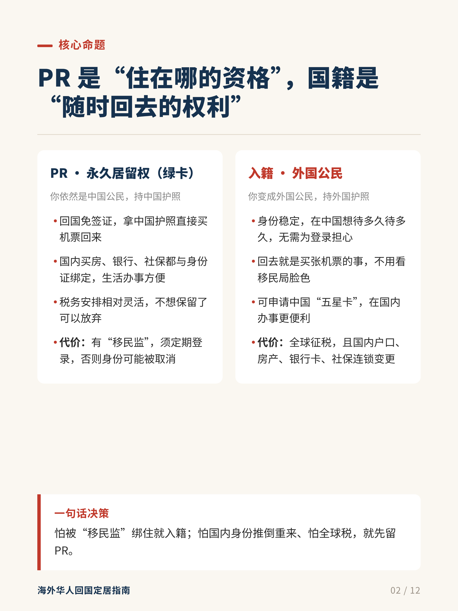
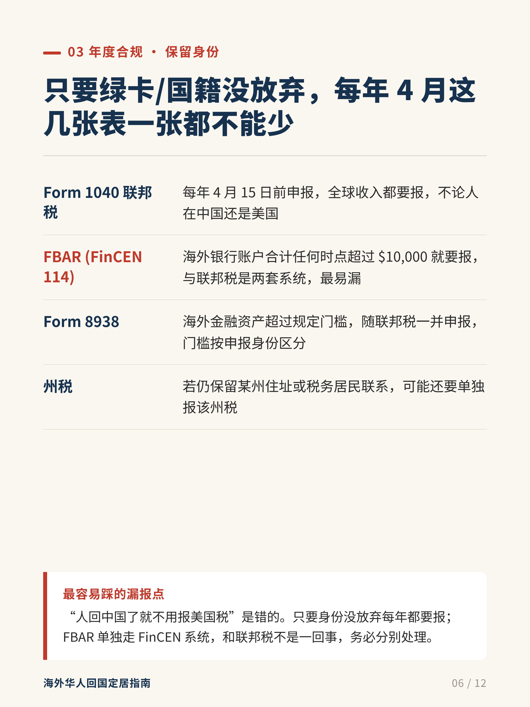
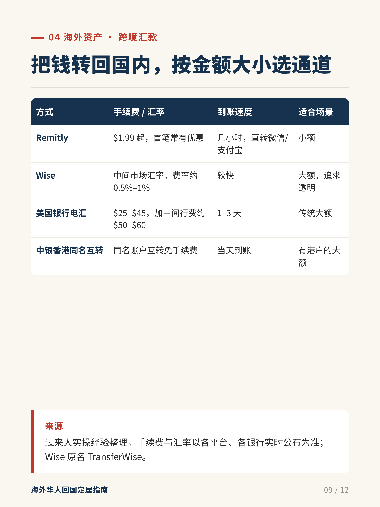

# 小红书干货图文生成器（XHS Experience Post）

把干货 / 经验 / 攻略类文字，一键批量生成**可直接发布的小红书竖版图文**。

HTML/CSS 精确排版 + Chromium 高清截图，**文字 100% 准确，零错版**——专治 AI 生图乱码、漏字、错数字。

## 为什么值得用

干货贴的核心是**文字准确、数字不出错**。AI 生图 / 改字会乱码、漏字、错数字，而本工具：

- 用 HTML 排版，字体、字号、配色、对齐完全可控
- 文字从源材料直接复制，**杜绝错版**
- 一次改数据，**批量出 12 张**统一风格的高清图
- 排版规范从小红书爆款调研沉淀，开箱即用

## 效果展示

| 双栏对比页 | 要点清单页 | 表格对比页 |
|---|---|---|
|  |  |  |

## 核心能力

- **3:4 竖版满屏**：1080×1440 CSS，导出 2160×2880 PNG，信息流占屏最大
- **爆款排版规范**：封面满版深色 + 红标签 + 金色关键词高亮；内容页米白底 + 章节标签 + 金句收尾
- **四种内容组件**：要点行、圆形数字步骤、双栏对比、深蓝表头表格，覆盖 90% 干货贴结构
- **每页只讲一个点**：信息层级清晰，收藏欲拉满
- **金句收尾**：每页底部"过来人/避坑提醒"红条框，提升收藏率

## 适用场景

决策指南、避坑清单、流程步骤、优劣对比、参数/费用对比表、科普干货……一切"信息密度高、文字必须准确"的小红书图文。

## 如何获取完整版

本仓库为**展示版**，提供效果示例与能力说明；完整工具包（设计系统 + 生成模板 + 跨平台渲染脚本 + 使用文档 + 免费更新）为付费产品。

👉 **[点击购买完整版](你的购买链接在这里)**

购买后你将获得：

- 完整设计系统（base.css）与四种内容组件模板
- 跨平台渲染脚本（Windows / macOS / Linux 自动适配）
- 详细使用文档与示例工程
- 后续版本免费更新

## 常见问题

**Q：为什么仓库里没有代码？**
完整代码是付费产品，本仓库用于展示效果、建立信任。请通过上方购买链接获取。

**Q：生成的内容可以商用吗？**
可以。工具生成的图文归你所有，可自由发布、商用，无需额外授权。

**Q：购买后可以转卖给别人吗？**
不可以。本产品许可证为"个人使用、禁止转售"，详见 [LICENSE](LICENSE)。转售、再分发、上传公开平台均被禁止。

**Q：需要什么环境？**
Python 3.10+ 与任意 Chrome/Chromium 浏览器即可，无需服务器。

## License

[个人使用许可 · 禁止转售](LICENSE)
